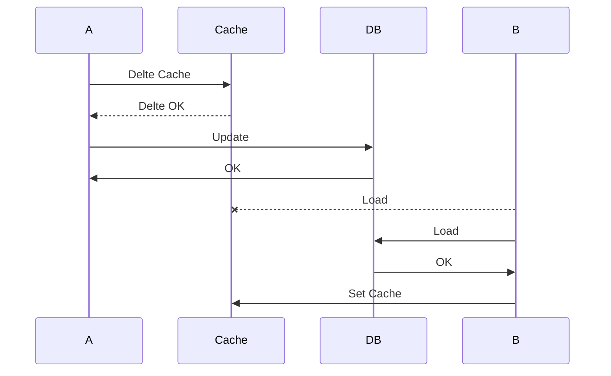
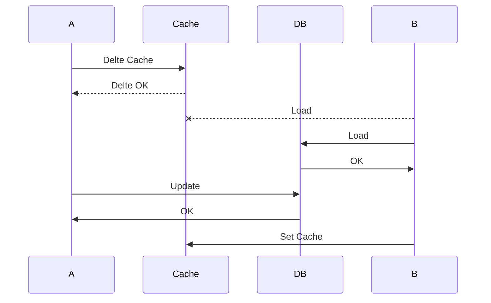
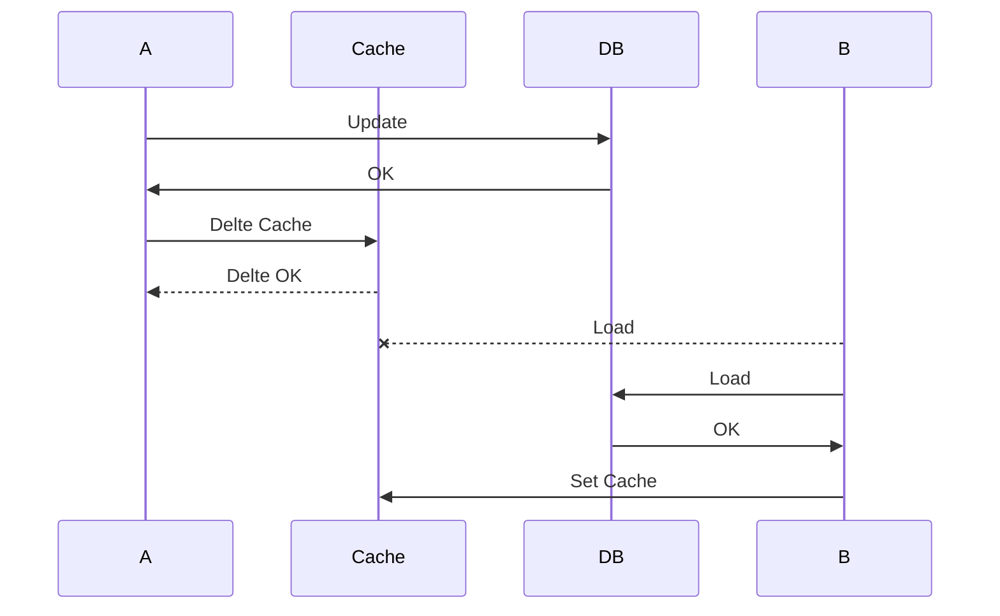
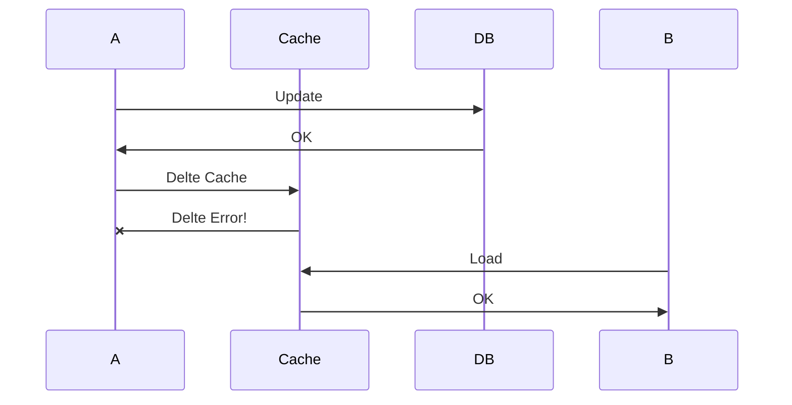
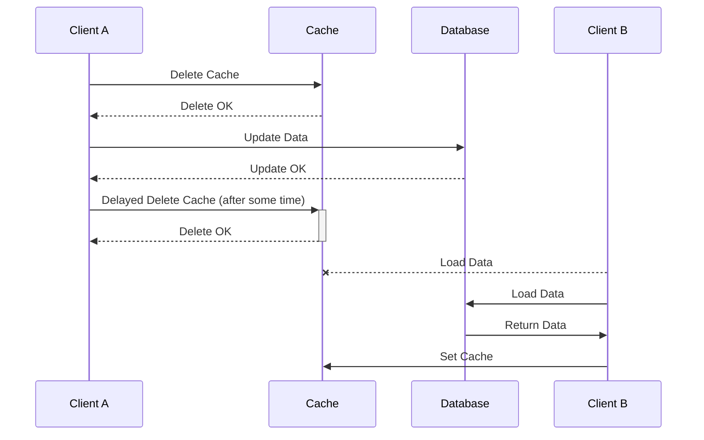
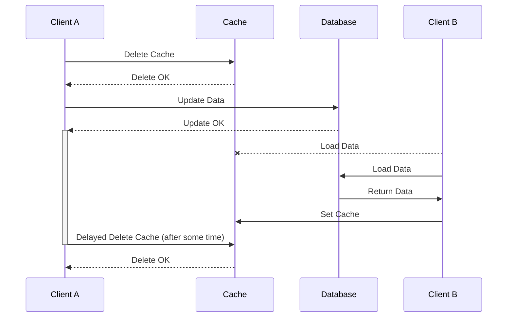
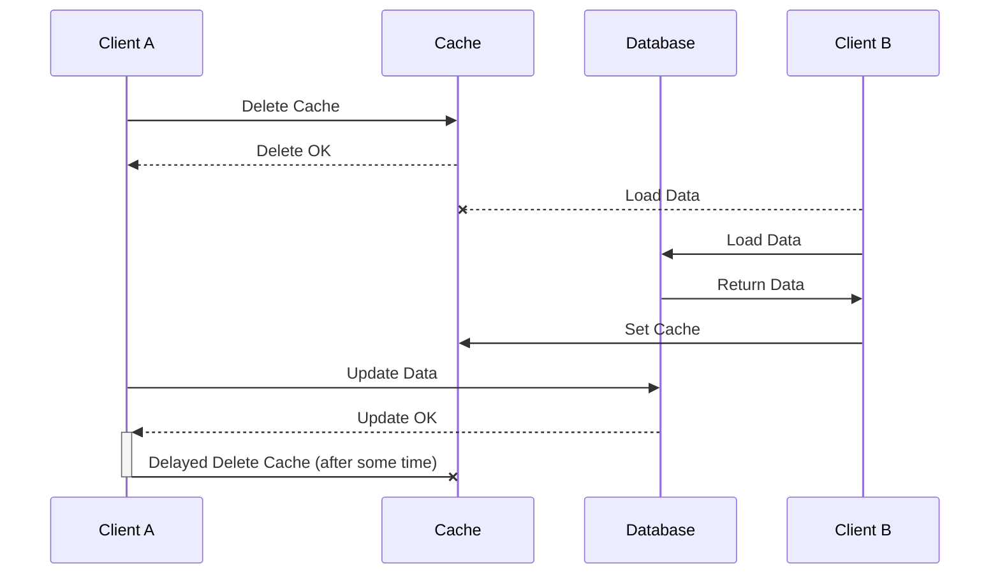

# 后端服务缓存总结

# 背景

最近再思考之前做的一个项目的时候， 有遇到一个问题， 那就是多级缓存的一致性问题。

之前在更新策略[^1]里面提到了 DB 和缓存的一些更新时的操作, 本文探讨存在并发场景下缓/多级缓存可能存在的问题.

# 并发场景下的集中缓存

在绝大多数以 HTTP 为核心的请求情况下， 由于不同的负载均衡策略， 可能会导致有不同的请求落在集中缓存中。

## **读**

一个读缓存的请求结果可能有以下三种：

1. 缓存命中， 且数据有效 （可以直接使用数据）
2. 缓存命中， 但数据无效 （使用兜底处理 / 请求 DB ）
3. 缓存未命中 （读 DB -> 写缓存）

笔者的技术有限， 在这里提供几种方式

### 分布式锁

> 分布式锁的主要目的是为了控制到达 DB 的流量

在缓存失效的情况下, 多个进程同时请求 DB, 在极端情况下会导致 缓存击穿[^2], 此时使用一个分布式锁来控制并发是一个不错的选择

考虑到这个场景下, 对于分布式锁[^3]的要求是能够过滤大多数并发请求即可, 无需追求 `etcd` ​带来的强一致性控制.

如果能够获取到锁， 则请求 DB 并返回。如果无法获取到锁， 则使用 （本地缓存 -> 兜底返回 -> 错误返回）

#### 问题

1. **在这种策略下， 可以保证对于 DB 的流量控制， 但是可能会导致出现同时出现较多的无效返回， 可能带来一些不好的体验？**

    如果我们的需求是尽可能的**返回数据**而不是**返回有效数据，**   可以添加一个本地缓存（一定要注意**本地缓存的 TTL**）
2. **如果存在非常大的流量， 这种策略会不会有问题？**

    如果我们的分布式缓存都没法承担这种热点， 这意味着我们还需要一个本地的锁来控制

    即保证在同一段时间内， 本地只有一个请求去尝试获取分布式锁。

    实现可以是通过 **实例 Hash** 获取本地锁。如果能够获取到锁， 则尝试请求分布式锁， 如果获取不到， 则按照 （本地缓存 -> 兜底返回 -> 错误返回）
3. **本地缓存 TTL 应该怎么设置？**

    个人建议是选择 30% - 50% 的集中缓存的 TTL, 在加上一些随机的偏移值（本地缓存的 10% 以内）

### NO TTL

> 即然造成失效的源头是缓存失效， 那么只要不失效就好了

对于一些活动类需求， 设计一套完美的方案是非常浪费时间的， 因为可能你的缓存 TTL 都比活动时间长

在这种情况下， 我建议你直接做缓存预热 + NOTTL

在活动结束后手动删除。

#### 问题

1. **怎么删除？**

    如果能够单拎出缓存实例最好， 如果不能， 那就设置一些共同的前缀， 然后再业务的低峰进行删除。
2. **怎么不对其他业务产生影响？**

    > *不要使用* `Keys`​*命令， 这会直接导致线上问题！*
    >

    ***不要使用*** `Keys`​***命令， 这会直接导致线上问题！***

    ***不要使用*** `Keys`​***命令， 这会直接导致线上问题！***

    你可以写一个脚本 使用 **SCAN + UNLINK 的**方式来处理

    这种方案的好处是能够比较好的保证不阻塞主业务逻辑 以及 不会因为大量删除 Key 导致出现 Slots Rebalance.

    ```go
    package main

    import (
        "context"

        "github.com/redis/go-redis/v9"
    )

    var c redis.Client

    func main() {
        ctx := context.Background()
        var cursor uint64 = 0
        var keys []string
        for {
            var err error
            keys, cursor, err = c.Scan(ctx, cursor, "biz_prefix*", 100).Result()
            if err != nil {
                break
            }
            if len(keys) == 0 {
                break
            }
            c.Unlink(ctx, keys...)
        }
    }

    ```

## **写 / 更新**

这两种操作带来的问题其实会比较多， 原因就出在这个并发环境以及一致性保证上了。

为什么？ 归根到底只有一点， 怎么保证并发环境下的一致性？

我们需要确定这个几个基本的规则：

1. **如果 DB 中没有写入， 那么必不能从缓存中读取出。**
2. **尽可能的返回及时的内容。**
3. **保证对底层 DB 有较小的读负载。**

有几种方案， 我们挨个分析下

### 更缓存 -> 更 DB

> ***我根本不推荐你使用这种方案， 因为不出现问题还好， 一旦出现问题就是巨大的麻烦。***

这种方案的优点是很快， 进程 A 更新后， 后续的进程可以无感知的直接使用新的缓存。

能较好的保证规则 2, 规则 3

但是问题是， 如果更 DB 失败了呢？

那么导致的结果会非常严重： 持久化出现问题 **相比给出一个过时的返回， 给一个错误的返回可能造成更大的风险。**

请一定慎重！!!

### 删缓存 -> 更 DB

这个方案听起来好像没有什么问题， 但是请不要忽略了一件事情， 在并发环境下， 一切皆有可能， 沟槽的并发。

在正常情况下， 我们的想法是删除缓存， 更新 DB, 然后其他的请求过来， 通过上述的**读缓存操作**获得了最新的 DB, 然后 DB 缓存也一致， 完美！



但是实际情况不然



在这种情况下， 删完缓存， 有另外一个 B 直接从 DB 获取给刷进去了， 那么就坏事儿了。

### 更 DB -> 删缓存

这个方案是一个比较可用的方案， 先更新 DB, 然后再删除缓存， 这样不就能保证一致性了吗？

正常处理如下



但是实际可能出现一些特殊的情况： 如果删缓存失败了呢？



#### 问题

1. **如果没法删除缓存呢？**

    那么后果就是要等到一个缓存 TTL, 才能获取到最新的数据。
2. **怎么改善？**

    其实缓存了一个老的数据并不是一个无法接受的事情。

    我们可以通过降低 TTL 的方式来提高一致性，  删缓存失败的出现频率有多高呢？

    另外就是如果第一次删缓存失败， 等待重试能够解决大部分问题。

### 延迟双删

删缓存， 更 DB, 再删缓存。

示意图：



改善了 删缓存 -> 更 DB 的影响范围， 我们前面提到了， 如果先删除缓存在更新 DB, 有可能在更新 DB 前， 被其他的进程给写了老的缓存。

在延迟双删的情况下：



看起来一切都很美好， 但是在极端的情况下可能出现



即在最坏的情况下， 可能会回退到 更 DB -> 删缓存 的情况。

#### 思考

1. **延迟双删改进了什么？**

    比较 删缓存 -> 更 DB, 解决了中间请求导致的不一致问题

    比较 更 DB -> 删缓存， 因为第一次删除的存在， 保证在 (Delete 缓存， Update DB] 中间只要没有请求就能保证一致性

    只有在存在中间请求， 且最后一次删除失败的情况下才会出现回退到到 **更 DB -&gt;**  **删缓存**的策略。
2. **延迟双删的延迟改怎么选择？**

    我的建议是选择业务 2 * P99, 这只是一个经验之谈， 请尽量考虑自己的业务场景以及对不一致请求数量容忍性来考虑

    延迟设置的越高， 整体一致性越好， 同时中间请求数量越多

    延迟设置的越低， 中间请求数量越少， 同时越有可能出现中间请求 `last SetCache` ​的情况， 进而导致出现数据不一致情况， 一致性破坏可能性越高。
3. **延迟双删有用吗?**

    没有用.

### 事件驱动的缓存同步

事件驱动的缓存同步是指使用事件来触发和协调缓存与数据源之间的数据同步。

这种模式特别适合于大规模、高性能的系统架构，因为它能够减少系统组件之间的耦合，提高数据处理的效率。

#### 实现

事件驱动的缓存同步通常涉及以下组件：

1. **事件生产者**：一般是基于业务操作产生事件的服务。通常来说是 MongoDB oplog, MySQL binlog （row 模式）
2. **事件传递系统**：负责事件的传输，常用的有消息队列系统，如 Kafka、RabbitMQ、Redis pub/sub 等。
3. **事件消费者**：订阅事件并执行缓存同步操作的服务。

实现步骤：

1. **捕获数据变更事件**：当数据源中的数据发生变更时，要生成一个事件。（通常使用 [Debezium](HTTPS://GitHub.com/debezium/debezium/blob/main/README_ZH.md）)
2. **发布事件**：将捕获的事件发布到消息队列系统中。这样可以解耦生产者和消费者，提高系统的伸缩性和容错能力。
3. **处理事件**：实现一个或多个事件消费者，它们从消息队列中订阅并接收事件，然后根据事件内容来更新缓存中的数据。

#### 优劣

**优点：**

- **低耦合**：生产者和消费者之间通过事件解耦，降低了系统间的直接依赖。
- **高可扩展性**：系统各部分可以独立扩展，满足不同的性能要求。
- **实时性**：可以实现接近实时的缓存更新，提高系统响应速度。
- **容错性**：消息队列系统通常具有容错机制，可以在某个组件失败时继续保持系统的稳定。

**缺点：**

- **复杂性**：引入了额外的组件和系统复杂性，需要更多的维护工作。
- **一致性挑战**：可能会出现数据不一致的情况，特别是在分布式系统中。
- **消息积压**：在高负载情况下，如果处理不及时，可能会导致消息堆积。
- **延迟波动**：系统的性能可能会受到网络延迟和消息队列性能的影响。

# 并发情况下的多级缓存

> 以下内容不适用

通常来说是不需要多级缓存的， 为什么？

在经典的后端场景下， 底层 DB 的典型 QPS 在 1W, 缓存中间件的 QPS 在 10W

通常来说， 很少有能够触碰到 10W QPS 的场景。

但是在极少数情况下， 例如鉴权/用户信息等等接口， 可能出现一些超高请求量的情况， 我个人是比较建议使用 缓存 Cluster 来解决这个问题， 如果经济实力允许的话， 能够最高支撑到 200 * 10W, 但是那个时候基础设施的建设已经超出我的能力理解范围外了。

本章节指代的多级缓存是由 LocalCache -> Redis Cache -> DB 的三级， **高性能的集中缓存， 有一层就够了。**

## 什么场景需要？

1. 能够保证同一个 Key（用户/IP）的请求都能落在一个服务实例上， 比如配置的 IP 负载均衡， 或者是使用长连接的情况下， 如果一个 Key 是随机的落在任意实例上的， 那么此时的本地缓存是没有什么效果的。
2. 超他妈的高的流量， 我的 Redis 顶不住了

    OK, 你可以试一试， 但是我没有遇到过， 所以你就听一听就好了。

总之， 保证你的请求的内聚性。

## 主要问题

引入了本地缓存之后， 主要的问题就是一致性问题， 即本地缓存 -> 集中缓存 -> DB 的一致性。

但是细细想来， 其实也没有那么复杂。

## 解决方案

### 集中缓存 -> DB 的一致性

这里的解决方案和章节 2 所示的一模一样， 没有任何改动

### 本地缓存的一致性

#### 读： 与集中缓存的一致性

看到这个标题， 你可能会有疑问， 为什么是本地缓存和集中缓存的一致性？

原因很简单， 因为我们通常认为本地缓存的 TTL 要远小于集中缓存， 如果频繁的请求 DB, 则可以直接取消掉集中缓存的存在。

**为什么？**

因为每个服务实例都存在一个本地缓存， 如果你设置了一个长的 TTL, 你还需要集中缓存吗？

如果 TTL 过期了， 直接请求 DB, 你还需要集中缓存吗？

OK, 总之， 我们确定了一点：

本地缓存的更新应该总是按照： 集中缓存 -> DB 这样的逻辑来处理。

#### 写： 与 DB 的一致性

看到这个标题， 你可能又有疑问， 为什么是本地缓存和 DB 的一致性？ 不应该是本地缓存 -> 集中缓存(Redis)的一致性吗？

因为集中缓存不论如何都是有可能出现不一致的情况的， 这一点在上面的标题也提到了。

最准确的结果应该总是从 DB 中获取。

请不要忘记了一件事情， 如果是写 或 更新的情况下， 我们一定可以知道最新的数据情况， 那么此时直接绕过 Redis 进行更新， 会有什么问题？

答案： 不存在任何问题。

因为你的本地缓存一定是最新的内容， 本地缓存和 DB 的一致性一定要比 集中缓存和 DB 的一致性要高。

所以， 这种情况下， 你可以为写/更新 导致的缓存更新设置一个比较高的 TTL.

我的建议是， 设置为读更新 TTL 的两倍， 具体视你的业务场景来处理

如果是一个写频率稍高的场景， 可以将 TTL 设置的稍小一些。反之， 就可以设置的大一点。

## 总结

其实看到这儿， 你也明白了， 本地缓存的引入其实会带来非常多的问题。

维护两个缓存其实是一件不那么容易的事情， 我的建议是能不用本地缓存， 就不用本地缓存， 99.9% 情况下，你不需要本地缓存。

当然， 如果基本不写入， 是一些比较静态的数据， 那么本地缓存还是非常推荐的。

# 一个真实的场景

## 背景

1. 一个 IM 即时通信的场景， C/S 维持长连接， 一个需求是用户的每个消息， 需要查看之前的历史记录。
2. 用户发送消息的频率还是比较高的， 所以可以认为是一个读多写多的场景。
3. 有其他的服务需要查看历史记录， 但是对一致性要求不高。

## 设计

1. DB 存储使用 MongoDB, 每一个请求都会落 MongoDB, 进行持久化处理
2. Server 端为每个 Client 维护一个 context, 在 context 中维护一个 List, 用来存放历史记录
3. 消息持久化之后， 异步的放入 Redis List 中。

## 分析

这就是典型的可以使用本地缓存的场景， 为什么？

因为在这中情况下， 可以最高效率的利用本地缓存， 几乎所有的本地缓存都可以使用到，而且除非断线重连。

如果不是因为其他的服务需要一个快速的而且允许不一致的数据访问方式， Redis 可以直接去掉的。

# 总结

在多级缓存架构中，一致性问题成为了一个关键的挑战，尤其是在高并发场景下。一致性问题主要来源于缓存与数据库状态不同步的问题，以及不同级别的缓存之间状态不一致的问题。处理这些问题的策略主要围绕数据更新路径的设计，以及缓存失效和更新机制。

## 单级缓存一致性的解决方案

### 读操作

- **分布式锁**：用于控制并发下对数据库的访问，以避免缓存击穿。但需注意，分布式锁可能导致大量的无效返回和流量冲击。
- **NO TTL**：对于短期的高流量活动，可以采用缓存预热加上不设置 TTL 的方法，活动结束后手动删除缓存。

### 写操作

- **更缓存 -&gt;**  **更 DB**：不推荐，因为一旦更新数据库失败，缓存中的数据将是陈旧的，造成数据不一致。
- **删缓存 -&gt;**  **更 DB**：可能会导致在删除缓存和更新数据库之间的窗口期内，其他请求将老数据写回缓存，造成不一致。
- **更 DB -&gt;**  **删缓存**：更为安全的方法，即使删除缓存失败，也只会导致数据短暂的不一致。
- **延迟双删**：结合删缓存 -> 更 DB 和 更 DB -> 删缓存 的方法，通过延迟删除来尽量减少不一致窗口期的大小。
- **事件驱动：**   性能强， 侵入低， 但是引入了新的组件， 可能会降低可维护性。

## 多级缓存一致性问题

在某些极端高流量情况下，可能需要采用多级缓存来分担集中缓存的压力。这时，除了要处理集中缓存与数据库之间的一致性问题外，还要处理本地缓存与集中缓存之间的一致性问题。

### 集中缓存和 DB 的一致性

对于集中缓存和数据库的一致性问题，解决方案与单级缓存一致性的解决方案相同。

### 本地缓存的一致性

- **本地缓存与集中缓存**：本地缓存的 TTL 应该小于集中缓存的 TTL，确保数据的更新能够及时反映到本地缓存中。
- **本地缓存与 DB**：写操作时，可以直接更新本地缓存与数据库，保证本地缓存的数据总是最新的。设置合理的 TTL 以确保数据一致性。

## 最终总结

多级缓存一致性问题的处理是一个复杂的挑战，特别是在高并发、读写频繁的背景下。每一种缓存一致性策略都有其适用场景和潜在风险。

在设计缓存更新机制时，需要全面考虑业务需求、性能和一致性的平衡。

在大多数情况下，单级缓存足矣。而在特定高流量场景下，引入本地缓存是必要的，但这需要仔细设计以确保数据一致性，并尽量减少复杂性。

# 加餐

如果我们从一致性模型[^4]的角度出发来看, 我们或许会有一些新的体会.

> 在此情况下， 我们主要讨论写操作以及读操作中数据一致性问题。

如果我们将缓存以及 DB merge 成一个黑盒

1. 对该黑盒可以进行读写
2. 存在多个不相关的进程进行读写。

所以是满足一致性分析的条件的， 而且从数据角度来看， 因为缓存 TTL 的问题， 所以最终总是能达到最终一致性的。

我们主要考虑的就是不一致窗口， 以及观察的一致性。

- **更缓存 -&gt;**  **更 DB**：这种情况下可能出现写失败， 但能读取到错误数据， 因此这种方案的 Store **不能保证基本的存储能力。**
- **删缓存 -&gt;**  **更 DB**：不一致窗口最高可能到达 TTL, 不保证单调读。
- **更 DB -&gt;**  **删缓存**：不一致窗口最高可能到达 TTL, 但是可以保证单调读。
- **延迟双删**：不一致窗口最高可能到达 TTL,但是平均窗口时间必定短于**更 DB -&gt;**  **删缓存，**   不可以保证单调读。
- **事件驱动：**   不一致窗口最高是 时间接收 -> 写入的时间， 可以保证单调读。

**为什么一定要先更 DB?**     只有先更 DB 才能保证 最终一致性。

[^1]: # 更新策略

    ## 更DB, 删Cache

    问题: 中间过程中, 可能会有其他进行获取Cache, 导致出现不一致

    ## 删缓存, 更DB

    问题: 中间过程中, 可能会有其他进行获取Cache, 因为不存在缓存, 主动拉取, 导致DB与Cache出现不一致

    ## 延迟双删

    删缓存, 更DB, 再删缓存.

    引入了一个更多的操作, 最坏情况下有可能退化为方案1, 即在更新DB到第二次删缓存期间, 依然有可能引入不一致.


[^2]: # 缓存击穿

    ## 定义

    缓存击穿是指热点key在某个时间点过期，而此时恰好服务收到对这个key的大量并发请求，缓存失效，进而增大数据库的压力。缓存击穿与缓存雪崩类似，不同之处在于缓存击穿是热点key过期，而缓存雪崩是不同数据同时过期。

    ## 解决方案

    1. 热点Key设置不过期
    2. 分布式锁控制实现串行化


[^3]: # 分布式锁

    分布式锁的几个基本特征

    1. 互斥性 / 安全性

        绝不允许多个client同时获得锁
    2. 受限存活

        在实现分布式锁的过程中要考虑到 client 可能会出现 crash 或者网络分区，你需要原子申请分布式锁及设置锁的自动过期时间，通过过期、超时等机制自动释放锁，避免出现死锁，导致业务中断。
    3. 高性能 / 高可用

        加锁、释放锁的过程性能开销要尽量低，同时要保证高可用，确保业务不会出现中断。


[^4]: # 一致性模型

    # 模型

    Store: 一个黑盒用以提供数据可用性, 以及数据持久性

    A/B/C: 三个相互独立的Process, 对Store有读写操作

    # 一致性

    ### 强一致性

    当A写入到Store后, 之后的A,B,C的读操作都将返回最新值

    ### 弱一致性

    当A写入到Store后, Store不能保证A,B,C的读操作都将返回最新值.

    ### 最终一致性

    最终一致性是弱一致性的一种特例。

    假如 A 首先 write 了一个值到存储系统，存储系统保证如果在 A,B,C 后续读取之前没有其它写操作更新同样的值的话，最终所有的读取操作都会读取到最 A 写入的最新值。

    此种情况下，如果没有失败发生的话，“不一致窗口”的大小依赖于以下的几个因素：交互延迟，系统的负载，以及复制技术中 replica 的个数（这个可以理解为 master/salve 模式中，salve 的个数）。

    # 视角

    1. 数据一致性
    2. 事务一致性

    ## 数据一致性

    为了避免设备与网络的不可靠带来的影响，通常会存储多个数据副本。

    逻辑上的一份数据同时存储在多个物理副本上，自然带来了数据一致性问题。

    - 状态一致性是指，数据所处的客观、实际状态所体现的一致性.
    - 操作一致性是指，外部用户通过协议约定的操作，能够读取到的数据一致性.

    # 状态一致性

    ## 严格一致性

    要求任何写操作都能立刻同步到其他所有进程，任何读操作都能读取到最新的修改。

    要实现这一点，要求存在一个全局时钟，也就是说每台服务器的时间都完全一致，但在分布式场景下很难做到。

    之所以需要全局时钟是为了定义顺序, 即数据同步和读操作的顺序, 在任意一个进程都是一致的, 而这种能力只能通过全局时钟来实现.

    所以，严格一致性在实际生产环境中目前无法实现。

    ## 顺序一致性

    所有的进程以相同的顺序看到所有的修改。

    读操作未必能及时得到此前其他进程对同一数据的写更新，但是每个进程读到的该数据的不同值的顺序是一致的。

    比起严格一致性, 顺序一致性的特点是: 只要能够保证在任意进程上的写操作是有顺序即满足.

    ## 因果一致性

    因果一致性（Causal Consistency）是分布式系统中一种比较弱的一致性模型。

    它不要求系统全局的严格一致性，而是确保如果一个操作在因果关系上先于另一个操作，那么所有的进程在更新数据时，都应该保证这种先后顺序。

    换句话说，因果一致性能确保因果相关的操作的顺序，但对于因果无关的操作则不做此保证。

    例如，在社交网络中，一个用户发表了一条状态更新（事件A），随后另一个用户对这条状态进行了评论（事件B）。因为评论是对状态更新的直接响应，所以事件B因果依赖于事件A。在因果一致性模型下，任何观察到事件B的进程，也必须能够观察到事件A。但是，如果有一个第三个事件C，它与A和B都不具有因果关系（比如另一个用户在不同的话题上发表了一个不相关的帖子），那么C的发生与A和B的先后顺序在因果一致性模型下是不受限制的。也就是说，不同用户可能会以不同的顺序看到这些不相关的事件。

    这里是一个更加具体的例子：

    1. 用户1在论坛帖子中提出了一个问题（事件A）。
    2. 用户2看到了这个问题，并发表了自己的回答（事件B）。
    3. 用户3看到回答后，对该回答进行了点赞（事件C）。

    在因果一致性模型中，事件C因果依赖于事件B（用户3必须看到回答才能点赞），而事件B因果依赖于事件A（用户2必须看到问题才能回答）。因此，任何观察到事件C的用户，必须先看到事件B，再看到事件A，以此来维持因果顺序。但是，如果另外有一个用户4同时在另外一个不相关的帖子上发表了一个评论（事件D），那么其他用户看到事件D的顺序就不受这个因果关系的约束，可能在A、B、C之前或之后。

    # 操作一致性

    ## 单调读一致性

    如果一个进程读取数据项 a 的值，那么该进程对 a 执行的任何后续读操作，总是得到第一次读取的那个值或更新的值。

    这个比较容易理解，说白了，就是不能读到新数据后，再读到比这个数据还旧的数据；

    如果没读到新数据，一直读的还是旧数据，单调读一致性并不关心这个问题。

    ## 单调写一致性

    一个进程对数据项 a 执行的写操作，必须在该进程对 a 执行任何后续写操作前完成。

    这个很容易满足，注意这里是一个进程，所有的写操作都是顺序的。(这也是为什么要有全局时钟)

    即写操作是有顺序的, 先发生的写总是在后发生的写之前.

    ## 写后读一致性

    一个进程对数据项 a 执行一次写操作的结果，总是会被该进程对 a 执行的后续读操作看见。

    这个比较常见，比如数据库采用 Master-Slave 结构部署时，写完 Master 数据库，如果从 Slave 读取，有可能读不到，就不满足写后读一致性了。

    ## 读后写一致性

    同一进程对数据项 a 执行的读操作之后的写操作，保证发生在与 a 读取值相同或比其更新的值上。

    这个问题经常出现的场景是，如果数据存储了多个副本，因为没有及时同步，在第一个副本上读了数据，去第二个副本上写，出现不一致的情况。

    # 注意

    顺序一致性的顺序指的是读写的顺序, 即在任何一个节点上, 读写都必然有序

    单调读 / 单调写, 更加强调某一类操作的顺序
