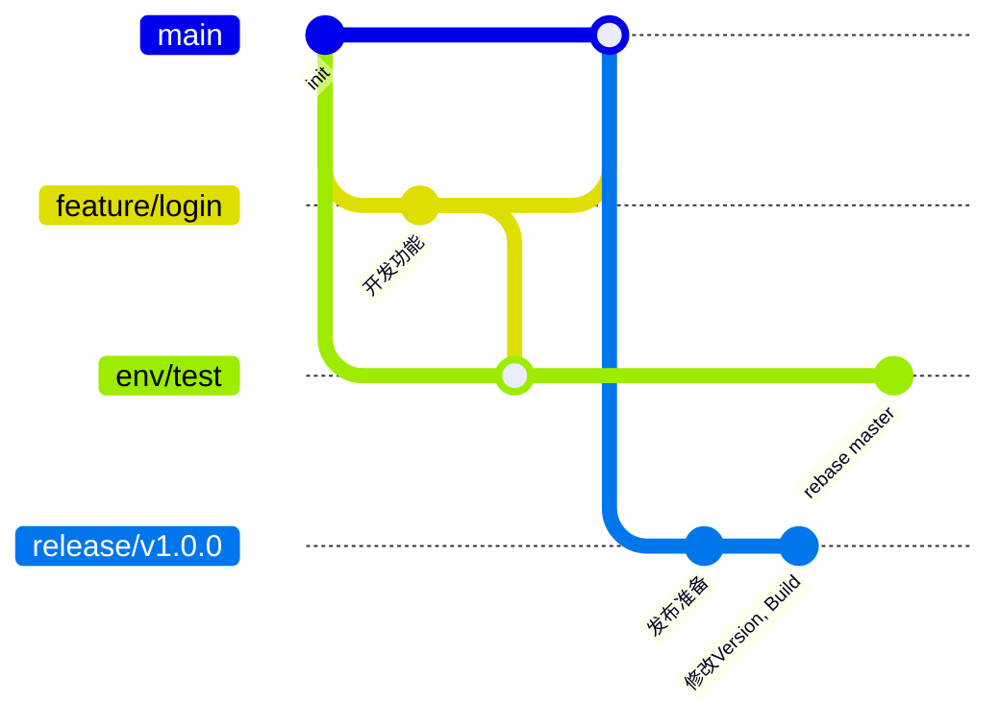

# Git分支管理

# 为什么需要分支管理?

### 开发效率

- 统一的分支管理避免混乱
- 明确的开发流程减少沟通成本
- 新人容易理解和快速上手

### 优化CICD流程

- 分支策略配合自动化部署
- 自动化测试和构建更可靠

### 减少代码冲突

- 规范的分支创建和合并流程
- 明确的职责划分减少冲突

# 常见Git分支管理方案对比

## [GitFlow](https://www.git-tower.com/learn/git/ebook/cn/command-line/advanced-topics/git-flow)


```
master    - 产品分支
develop   - 开发主分支
feature/* - 功能分支
release/* - 发布分支
hotfix/*  - 紧急修复分支
```

## [GitHub Flow](https://docs.github.com/en/get-started/using-github/github-flow)


```
main      - 主分支
feature/* - 功能分支
```

## [GitLab Flow](https://about.gitlab.com/topics/version-control/what-is-gitlab-flow/)


```
production - 生产环境
main       - 主分支
develop    - 开发分支
feature/*  - 功能分支
```

## [Trunk Based](https://trunkbaseddevelopment.com/)


```
main      - 主干分支
feature/* - 短期特性分支
```

## [Ali AoneFlow](https://developer.aliyun.com/article/573549)


# Tripo Backend 分支管理方案

我们现在的团队有什么特点?

1. 成员数量较少
2. Commit频率中等
3. Code Review习惯

基于以上几个特点, 我们姑且命名这样一种开发方式: TripoFlow, 这里的Tripo指代的`master`​-`feature`​-`env`三种类型分支

- ​`master`​是主干分支, 是`feature`​分支的`from`.
- ​`feature`​是功能分支, 也是开发人员最常接触的分支, `feature`​分支最终合入`master`分支
- ​`env`是环境分支, 每一个分支都和一个环境对应 (线上除外)

## 示意图



## 开发流程

1. 从`master`​拉取`feature`分支
2. 开发, commit在`feature`​分支, 请注意经常性的`rebase master`
3. 测试, 将feature分支的代码, `cherry-pick`​到`test`​分支, `CICD`自动打包部署
4. 测试通过, `PR`​到`master`​, 找同事`review`
5. ​`PR`通过, 开发结束.

## 上线流程

### 敏捷上线

1. ​`master`​打上版本`Tag`
2. Push Tag
3. CICD自动打包
4. 手动部署, 观察log

### 版本迭代

1. ​`master`​的拉出一个临时分支`release`​, 在某个`commit`​打上版本`Tag`
2. ​`CICD`自动打包
3. 手动部署, 观察log
4. 删除Release

## HotFix

1. 拿到线上tag的`commit`​, 基于此`commit`​新建分支`hotfix`
2. ​`CP`test进行测试, 没问题重打Tag,
3. 从`master`​分支拉出`hotfix`​分支, `Push` Remote, 自动打包.
4. 修复完成, 将commitPR到`master`
5. PR通过, 完成修复

# One More Thing: 什么是一个好的Commit?

> [Commit Guidlins](https://github.com/angular/angular.js/blob/master/DEVELOPERS.md#-git-commit-guidelines)

我将帮您将这份文档改编为一个通用的Git提交规范指南。以下是翻译和改编后的版本：

# Git提交规范指南

## 提交消息格式

每个提交消息包含标题、正文和页脚三个部分。其中标题部分采用特殊格式，包含类型（type）、作用域（scope）和主题（subject）：

```
<type>(<scope>): <subject>
<空行>
<body>
<空行>
<footer>
```

标题部分是必需的，而作用域是可选的。

提交消息的任何一行都不应超过100个字符！这样可以确保消息在GitHub以及各种Git工具中都能够方便地阅读。

### 类型（Type）

必须是以下类型之一：

- ​`feat`: 新功能
- ​`fix`: 修复bug
- ​`docs`: 仅文档变更
- ​`style`: 不影响代码含义的变更（空格、格式化、缺失分号等）
- ​`refactor`: 既不修复bug也不添加新功能的代码变更
- ​`perf`: 提升性能的代码变更
- ​`test`: 添加或修正测试代码
- ​`chore`: 构建过程或辅助工具的变更

### 作用域（Scope）

作用域用于说明提交影响的范围。例如可以是模块名称、包名称、或者其他有意义的分类名称。

当变更影响多个作用域时，可以使用 `*`。

### 主题（Subject）

主题是对变更的简洁描述：

- 使用祈使句、现在时态："change"而不是"changed"或"changes"
- 首字母不要大写
- 结尾不要加句号

### 正文（Body）

与主题一样，使用祈使句、现在时态。正文应该包含变更的动机，并与之前的行为进行对比说明。

### 页脚（Footer）

页脚部分应当包含任何与Breaking Changes（破坏性变更）相关的信息，同时也可以在这里引用与本次提交相关的Issue编号。

Breaking Changes应该以`BREAKING CHANGE: `开头，后面跟一个空格或两个换行符。剩余的提交消息用于描述变更内容。

## 示例

```
feat(auth): 添加用户认证功能

实现基于JWT的用户认证机制，包含以下功能：
- 用户登录接口
- Token生成与验证
- 刷新Token机制

这次更新显著提升了系统的安全性，取代了之前的基本认证方式。

BREAKING CHANGE: 
- 所有API请求现在需要在header中携带JWT Token
- 移除了基本认证支持

Closes #123
```

‍
