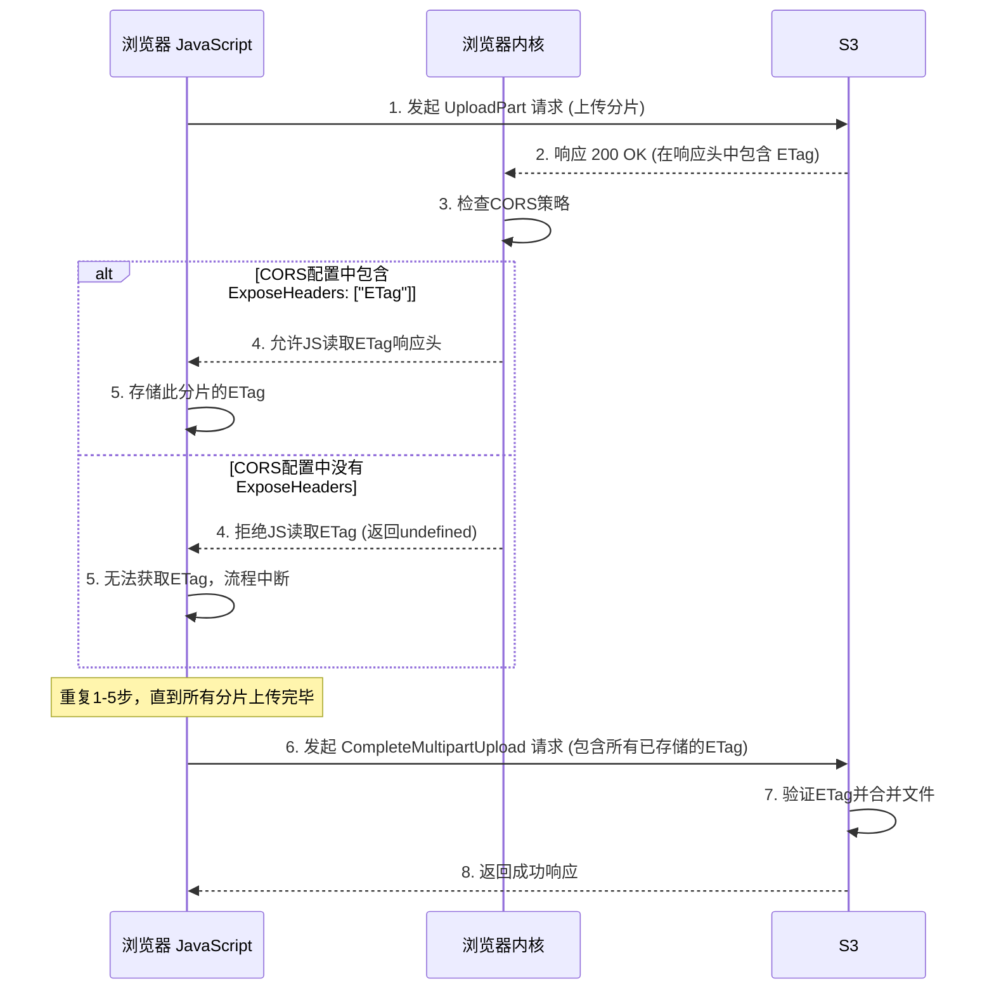

# S3 分片上传、ETag 与 CORS 深度解析

### 目录

1. **ETag 在分片上传中的核心作用**

    - 1.1 单文件上传的 ETag
    - 1.2 分片上传的 ETag (核心机制)
    - 1.3 ETag 的三大价值
2. **CORS 与** **​`ExposeHeaders`​**​ **：为何对浏览器上传至关重要**

    - 2.1 浏览器安全基石：同源策略 (Same-Origin Policy)
    - 2.2 `ExposeHeaders` 的作用：授权浏览器读取响应头
    - 2.3 分片上传流程中的依赖链
3. **S3 分片上传的完整注意事项与最佳实践**

    - 3.1 规划与设计
    - 3.2 实现与错误处理
    - 3.3 成本与安全

---

### 1. ETag 在分片上传中的核心作用

ETag (Entity Tag) 是 HTTP 协议中的一个标准头，用于验证资源的版本和完整性。在 S3 中，它的实现方式根据上传类型而有所不同。

#### 1.1 单文件上传的 ETag

对于通过标准 `PUT`​ 请求一次性上传的单个文件，其 ETag 通常是该文件内容的 **MD5 哈希值**。

```
ETag: "f446c0780b396b2440b85275997b83ce"
```

这提供了一个简单有效的方法来验证文件在传输过程中是否损坏。

#### 1.2 分片上传的 ETag (核心机制)

当文件被分割成多个部分（Part）上传时，最终对象的 ETag **不再是整个文件的 MD5 哈希值**。其生成规则更为复杂，这也是其强大之处：

1. **分片级 ETag**：客户端每上传一个分片，S3 都会计算该**分片内容**的 MD5 哈希值，并将其作为 ETag 在 `UploadPart` 响应头中返回给客户端。
2. **对象级 ETag**：当所有分片上传完毕，客户端发起 `CompleteMultipartUpload` 请求时，S3 会执行以下操作来生成最终对象的 ETag：

    - 获取每个分片 ETag 的二进制 MD5 值。
    - 将这些二进制值**拼接**在一起。
    - 计算这个拼接后内容的 MD5 哈希值。
    - 最终 ETag 的格式为：`{拼接后内容的MD5哈希值}-{分片数量}`。

**示例**：一个文件分为2个分片上传。

- Part 1 的 ETag: `"9bb58f26192e4ba00f01e2e7b136bbd8"`
- Part 2 的 ETag: `"771569733c7a726895e0c51203a950d8"`
- 最终对象的 ETag: `"3858f62230ac3c915f300c664312c11f-2"`

#### 1.3 ETag 的三大价值

这种设计为分片上传提供了三大核心价值：

1. **分片完整性验证**：S3 在接收到每个分片时，都会验证其完整性。客户端也可以通过比较自己计算的 MD5 和 S3 返回的 ETag 来确认分片是否成功上传。
2. **整体对象完整性验证**：最终的 ETag 确保了所有分片都已按正确的顺序、无损坏地组合成了最终对象。任何一个分片的错误或顺序错误都会导致最终 ETag 计算失败。
3. **支持可靠的重传**：如果某个分片上传失败，客户端只需重传该分片即可。由于每个分片都有独立的 ETag，客户端可以精确地跟踪哪些分片成功，哪些失败，从而实现高效的断点续传。

### 2. CORS 与 `ExposeHeaders`：为何对浏览器上传至关重要

当您使用 S3 Transfer Acceleration 时，通常是为了优化从地理位置分散的浏览器客户端到 S3 的上传速度。这就引入了浏览器环境下的跨域资源共享（CORS）问题。

#### 2.1 浏览器安全基石：同源策略 (Same-Origin Policy)

出于安全考虑，浏览器默认禁止 JavaScript 代码访问来自不同源（协议、域名、端口任一不同）的服务器响应。这意味着，如果您的 Web 应用部署在 `https://www.myapp.com`​，它默认无法读取来自 `https://tripo-data.s3-accelerate.amazonaws.com` 的响应头。

#### 2.2 `ExposeHeaders` 的作用：授权浏览器读取响应头

CORS 是一种机制，允许服务器明确告知浏览器，哪些源的请求是安全的，以及哪些响应信息可以被客户端的 JavaScript 读取。

在 S3 的 CORS 配置中，`ExposeHeaders`​ 字段的作用就是**白名单**。它告诉浏览器：“虽然我们是跨域的，但我允许你的 JavaScript 代码读取以下这些响应头。”

```json
"ExposeHeaders": [
    "ETag"
]
```

#### 2.3 分片上传流程中的依赖链

在浏览器进行分片上传时，会形成一个关键的依赖链：



**结论**：**如果没有在 CORS 中暴露** **​`ETag`​**​ **，浏览器 JavaScript 将无法获取每个分片上传成功后返回的 ETag 值。因此，它将无法构建最后一步** **​`CompleteMultipartUpload`​**​ **请求，整个分片上传流程必然失败。**

### 3. S3 分片上传的完整注意事项与最佳实践

#### 3.1 规划与设计

1. **触发阈值**：确定何时使用分片上传。通常建议对大于 100MB 的文件启用。
2. **分片大小**：

    - S3 规定，除最后一个分片外，每个分片大小必须至少为 5MB。
    - 分片总数不能超过 10,000 个。
    - 最佳实践：选择 8MB 到 100MB 之间的分片大小，以平衡上传性能和失败重传的开销。
3. **并发上传**：规划并发上传分片的数量。利用浏览器的并发连接能力（通常为 6 个）或 Node.js 的异步能力可以显著提高上传速度。

#### 3.2 实现与错误处理

1. **状态跟踪**：客户端必须可靠地跟踪每个分片的上传状态、PartNumber 和返回的 ETag。
2. **CORS 配置**：如上所述，务必在存储桶的 CORS 策略中暴露 `ETag`。

    ```json
    {
        "AllowedOrigins": ["https://www.myapp.com"],
        "AllowedMethods": ["GET", "PUT", "POST", "DELETE"],
        "AllowedHeaders": ["*"],
        "ExposeHeaders": ["ETag"],
        "MaxAgeSeconds": 3000
    }
    ```
3. **错误重试**：为 `UploadPart` 请求实现带有指数退避（Exponential Backoff）的重试逻辑，以应对临时的网络问题。
4. **中止上传 (非常重要)** ：

    - 如果用户取消上传或上传过程因不可恢复的错误而失败，**必须**调用 `AbortMultipartUpload` API。
    - 否则，已上传的分片将永久保留在 S3 中并持续产生存储费用，直到您手动清理。

#### 3.3 成本与安全

1. **成本控制**：

    - **孤儿分片**：未完成的分片上传会产生存储成本。
    - **生命周期策略**：为存储桶配置生命周期规则，自动清理在指定天数（例如 7 天）后仍未完成的分片上传，这是防止成本失控的最后一道防线。
    - **API 请求费用**：分片上传涉及多次 API 调用（`Create`​, `UploadPart`​, `Complete`​/`Abort`），会产生相应的请求费用。
2. **安全**：

    - **最小权限原则**：使用 STS 临时凭证或预签名 URL 进行上传。为分片上传授权时，除了 `s3:PutObject`​，还需授予 `s3:ListMultipartUploadParts`​, `s3:AbortMultipartUpload` 等特定权限。
    - **服务器端加密**：在 `CreateMultipartUpload` 请求中指定服务器端加密选项，确保数据在 S3 上静态加密。
