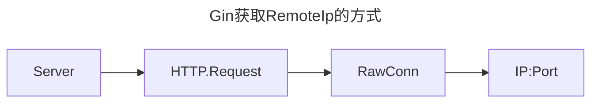
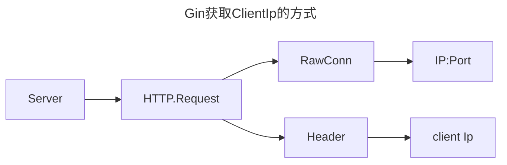

# 后端服务获取客户端IP的一些注意事项

​#Gin#​ #HTTP#​ #WEB#

# 背景

在典型的WEB后端服务中, 怎样才能获取到客户端IP呢?

同事最近在尝试进行负载均衡时, 有一个这样的需求.

但是需要注意的是, 在现在越来越负载的网络环境中, 真的能够准确的获取客户端IP吗?

# 方案

首先我们要确定一点, HTTP协议协议中是不会直接写入发起方的IP的, 我们需要一些更加特别的方式才可以获取到

## 通过TCP/IP获取

在`Gin`​框架中, 提供了`RemoteIP()`来获取客户端的IP

## 通过Header获取

在目前常见的一些负载均衡器中(例如nginx / k8s ingress), 直接通过TCP连接获取到的IP地址往往是负载均衡器的IP地址，而不是最终用户的实际IP地址。这是因为负载均衡器作为中介，客户端与服务器之间的连接是通过负载均衡器建立的。因此，从服务器的角度来看，所有的请求似乎都来自于负载均衡器。

为了解决这个问题, 可以通过HTTP头部的一些字段间接地获取到客户端的IP地址。这通常通过以下HTTP头部字段实现：

1. ​`X-Forwarded-For`​: 当使用HTTP代理或负载均衡器时，这个字段会包含原始客户端的IP地址。如果请求经过了多个代理，`X-Forwarded-For`可能包含一个IP地址列表，链条中的每个代理都会把客户端的IP地址追加到列表的末尾。
2. ​`X-Real-IP`​: 类似于`X-Forwarded-For`，这个字段也是用于标识客户端的原始IP地址，但通常只包含一个IP地址，用在一些代理服务器中。
3. ​`Forwarded`​: 这是一个相对较新的HTTP头部字段，用于提供关于代理的信息，包括客户端IP。它的格式通常是`Forwarded: for=<clientIP>`。

在`Gin`​中, 实现了这个功能, 通过`clientIP()`来获取此IP

# 总结

以上简单的介绍了目前获取客户端IP的一些简单的方式, 在实际的工作中, 需要注意对于客户端IP的需求等级, 更加建议使用`ClientIP`获取, 以获得最准确的结果.
