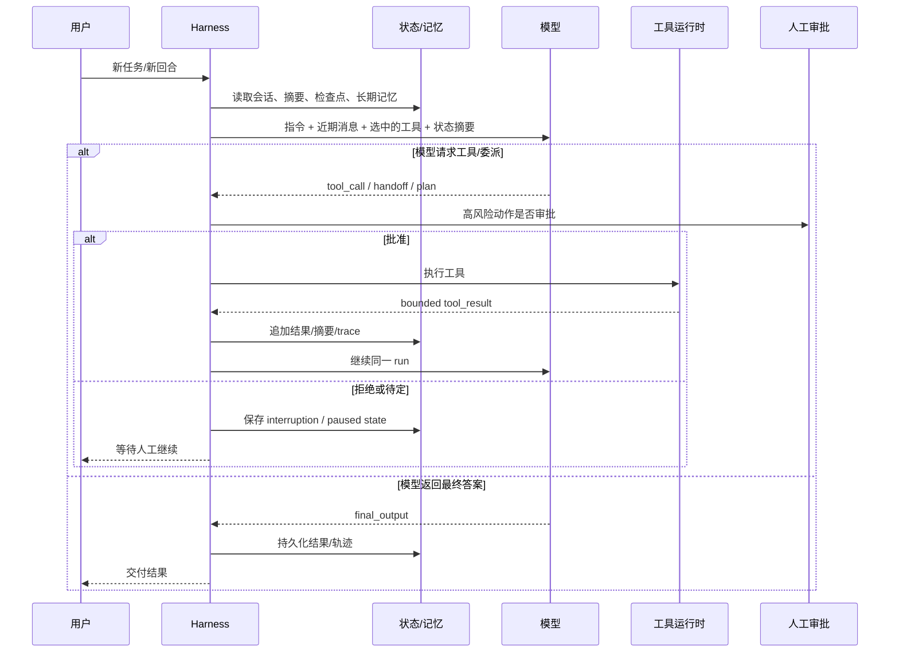
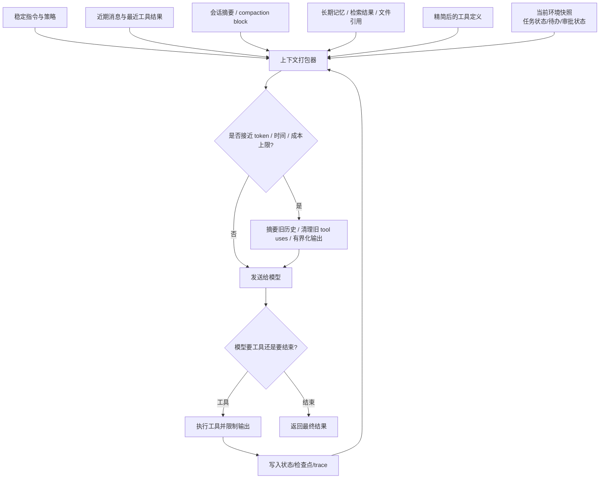

# Tager: Agent Loop

1. #### Loop 内的操作

- **生命周期管理：**  核心的 Loop 不仅仅是调工具，而是涵盖了“构造上下文 → 调用模型 → 执行工具 → 更新状态 → 继续或结束”的完整闭环
- **工具结果的工件化 (Artifactization)：**  把原始的大型工具输出直接追加到历史记录中是早期的做法 。如今的主流做法是对结果进行边界控制（bounded tool\_result）并工件化 。例如，Google ADK 明确规定大文件应进入 Artifacts 而不塞进 session.state ；Anthropic 引入了可引用的文档（citable documents）和工具结果清理（tool result clearing） 。
- **检查点与状态写入：**  在每次迭代执行工具或触发暂停前，系统都会落盘 trace 并保存当前状态（save\_checkpoint），确保长任务可恢复、可审计。

2. #### Loop 的截止条件

- **从单一阈值到三层防线：**

  - **语义层停止：**  由模型自身的推理决定。例如 Anthropic 模型会返回 `stop_reason`​ 为 `tool_use`​（请求工具）或 `end_turn`（完成回答）
  - **系统层边界：**  防止死循环的硬性约束。包括 Anthropic 的 `pause_turn`​ 或 `model_context_window_exceeded`​ ；OpenAI 的 max-turn failures ；Pydantic AI 的 `UsageLimits`（限制请求数、token 或工具调用次数）
  - **治理与安全层：**  当遇到高风险动作（如写入数据库、转账、发送邮件）时，系统会触发人类审批（human approval）或中断（interrupt） 。在现代架构中，“暂停（Paused）”不再被视为异常，而是运行时的一等分支 。

3. #### Loop 的内部变量

- **工作层与压缩层状态：**  内部变量主要由近期的消息历史、临时工作状态和会话摘要组成 。当上下文逼近阈值时，旧的消息和陈旧的工具输出会被转换为压缩摘要（compaction block） 。
- **思维轨迹 (Thinking/Reasoning)：**  \* Anthropic 暴露了显式的 `thinking blocks`。在工具调用循环中，与工具请求对应的 thinking block 必须原样带回，否则会因签名校验失败而报错；但前序的思维块会被自动从计算中剥离以节省空间 。

  - OpenAI 则更倾向于隐藏原始的 CoT（思维链），通过返回 `reasoning summaries`​（可见摘要）或通过 `encrypted reasoning items`（加密推理项）在不暴露明文的前提下维持多轮的推理连续性 。

4. #### Loop 的外部变量

- **外置化上下文的崛起：**  为了解决单一窗口的容量和注意力瓶颈，越来越多系统将上下文“外部化” 。外部变量构成了 Loop 的外部层 。
- **多环境与连接器：**  Manus 的架构提供了一个典型的分布式 Harness 范例 。它的外部变量包括云端沙箱工作区、通过 Google Drive Connector 实时挂载的外部知识库文件夹、以及通过 Browser Operator 桥接的已登录本地浏览器会话 。
- **按需获取机制：**  这种设计的核心思想是：不是让一个模型在 prompt 中记住所有东西，而是让 Agent 能够在需要时，动态地去外部文件系统、数据库或并行子代理那里获取最新的上下文 。
