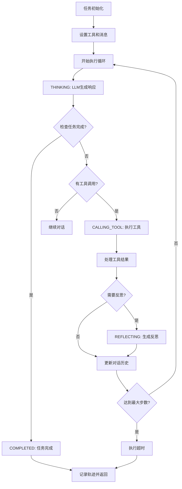

# Trae-Agent源码剖析

# 架构

```plaintext
┌─────────────────────────────────────────┐
│              CLI Interface              │
├─────────────────────────────────────────┤
│              Agent Layer                │
├─────────────────────────────────────────┤
│              Tools System               │
├─────────────────────────────────────────┤
│            LLM Client Layer             │
├─────────────────────────────────────────┤
│         Utils & Infrastructure          │
└─────────────────────────────────────────┘
```

# Agent

代码写的很烂, 明明有更简单的方案来抽象Agent, 如果不想要依赖Langchain也可以用pydantic-ai, 但是就抽象各种傻卵Agent.判断为写Java入魔了, 还在那AbstractClass???

```plaintext
┌─────────────────────────────────────────┐
│           TraeAgent (具体实现)           │
├─────────────────────────────────────────┤
│            Agent (抽象基类)             │
├─────────────────────────────────────────┤
│     AgentStep | AgentExecution         │
│     AgentState | AgentError            │
└─────────────────────────────────────────┘
```



# Tools

现在看使用Tools也非常的有限, 几乎没有学习的价值

```plaintext
TraeAgentToolNames = [
    "str_replace_based_edit_tool",
    "sequentialthinking",
    "task_done",
    "bash"
]
```

# 总结

我觉得trae-agent整体来看是一个不够字节的项目:

1. 不够现代化, 明明更简单就能实现的方案不用, 非要自己抽出一些很垃圾的概念, 我建议立刻用pydantic-ai重写client, agent的部分
2. 无脑的tools, 我本来以为字节能够给出一些富有新意的index + context-engine 甚至更好的一些解决方案, 但是实现令人失望, 完全依靠模型和简单的tools.

我认为: 基于 cherry-studio + FS MCP + SequentialThinking MCP的组合效果应该和现在的trae-agent效果差不多.

这个开源项目完全没有诚意, 代码垃圾, 创意垃圾, 就像是一个实习生项目一样, 如果trae项目组的能力就如这个开源项目所示, 那trae还是早点倒闭的好.

‍
