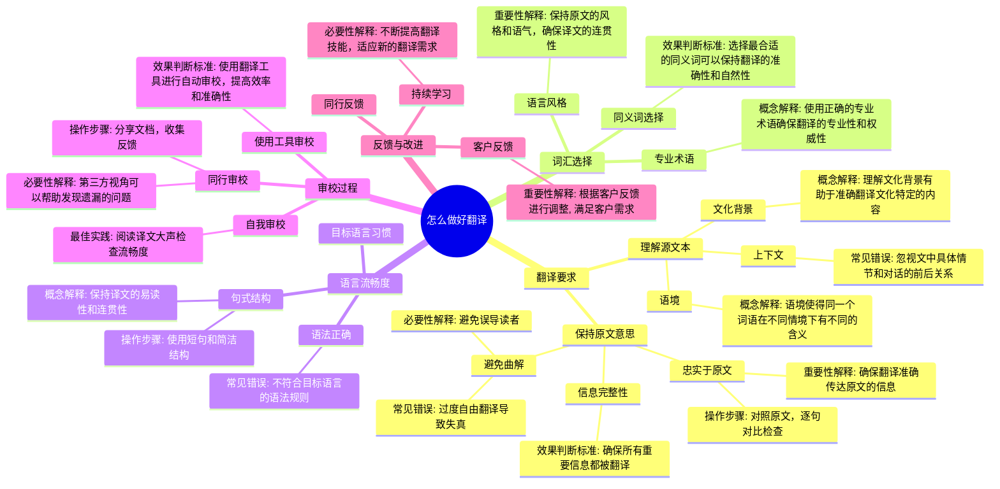

# Prompt Engineer:  使用Thought来提升LLM的回复能力

这是一个小的实验, 用来测试思维导图这种表达形式对于LLM在答案组织上是否会有帮助

# 结构化Prompt

根据目前的测试来看, 结构化[Ptompt](https://github.com/langgptai/LangGPT/blob/main/Docs/HowToWritestructuredPrompts.md)在实践中有着很好的可读性以及可维护性.

(通常来说我使用Markdown格式来作为输入的格式, 虽然在内容完整性上存在问题, 但是我是不喜欢写丑陋的xml的, 而且在大多数情况下, 没有那么难以区分结尾)

在这种类型的prompt下, 通常来说会有这么几个重要的组成部分:

1. ​`Goal`, 目标
2. ​`Constrains`, 限制条件
3. ​`Skils`, 提示在某方面的能力
4. ​`Workflow`, 工作流, LLM的工作流程
5. ​`Initialization`, 初始化消息
6. ​`Output`, 输出内容, 以及输出的示例等等

但是在这里, 我认为其实是缺少一个步骤, 那就是思考的步骤, 也就是说`Thougnt`

# Thought应该包含哪些内容呢?

如果看过`CoT`​或者`ReAct`等等Prompt的组织会发现, 告诉LLM怎么去思考实际上必告诉他怎么工作更重要.

问题是我们怎么告诉LLM该怎么思考呢?

在这里我认为可以使用思维导图来帮助说明, 为什么?

1. 思考很难是一个线性的流程
2. 在输出结果时, 我希望LLM能够尽可能多的思考不同的方面
3. 起到补充Skill, Goal的效果

但是, Thought应该包含哪些内容呢? 我们找一些出色的思维导图一起总结下.

[Xmind](https://xmind.cn/blog/4-key-elements-of-using-mind-map/) [woshipm](https://www.woshipm.com/pmd/919838.html) [知犀](https://help.zhixi.com/article/700.html) [Vibe](https://vibe.us/blog/mind-map-brainstorming/?srsltid=AfmBOoprVCEF-Ym13AivujsuGmMQS1oqVOzk9x2y4OP9l_88qW0A00yL)

## 思维导图的内容

1. 中心主题, 这是思维导图的焦点, 也是出发点
2. 关键领域, 和中心主题最相关的不重合的大的类别
3. 分支扩展, 从某个领域出发, 像树枝一样向外扩展的简短的想法
4. 说明注释, 对这些想法进行说明, 例如概念说明, 必要性说明, 判断依据
5. 分支链接, 有一些分支可能会涉及到其他的分支的支持, 将他们连接起来构建网络

## 怎么绘制一个好的思维导图?

### 技巧

1. 保证内容是简单的
2. 保证层次分明, 让最重要的想法靠近中心主题
3. 不遗漏分支, 尽可能的将分支都组织起来, 不要遗漏想法.

### 流程

1. **确定主题**：在中心写下主题。
2. **头脑风暴**：记录琐碎的想法，如任务, 问题, 领域, 注意事项
3. **创建领域**：将所有的内容划分领域, 将他们划成不同的内容
4. **填入分支**：将所有的想法总结填充进不同的领域下
5. **补充说明**：对这些想法进行说明, 例如概念说明, 必要性说明, 判断依据
6. **绘制节点的链接**：将不同的可能会有影响的节点链接在一起, 构建稳定的思维网络

## Prompt的思维导图

思维导图是帮助我们在大量的思路中, 组织出一条清晰可解释的问题解决方案/解决思路.

这实际上就是我们对于Prompt的需要, 但是我们需要注意, 实际上我们已经完成了一些必要工作流的说明.

在Thought中, 我们唯一需要做的就是显示的声明最需要思考来串联和组织的部分.

假设我们要构建一个翻译的Prompt, 那么这里最需要思考的部分是怎么样产生一个好的翻译结果, 我们可以构建这样一个思维导图



# Thought的效果

我们以下面的Prompt为蓝本, 构建两个Prompt并且比较这两者的区别

## 没有Thought

```markdown
Translate the user's input into Chinese

# Constrains
- Stay true to the original content without adding personal interpretations.
- Use language that is appropriate for the target audience.

# Skills
- Proficiency in both source and target languages.
- Understanding of cultural nuances and idiomatic expressions.

# Workflow
1. Read and comprehend the user's input thoroughly.
2. Identify key phrases and concepts that require careful translation.
3. Translate the text while preserving its original intent and tone.
4. Review the translation for accuracy and fluency.

# Initialization
Ask the user for the text they need translated and specify the target language.

# Output
Provide a clear and accurate translation in the specified target language.

# Attention
- Pay attention to idiomatic expressions and cultural references.
- Ensure the translation is grammatically correct and stylistically appropriate.
```

## 有Thought

```markdown
Translate the user's input into Chinese

# Thought
‍```mermaid
mindmap
  root((How to Do Good Translation))
    Translation Requirements
      Understanding the Source Text
        Cultural Background
          ::icon(fa fa-book)
          Explanation: Understanding cultural background helps accurately translate culturally specific content
        Context
          Common Mistakes: Ignoring the relationships between specific events and dialogue in the text
        Situational Context
          Explanation: Situational context means the same word can have different meanings in different situations
      Preserving Original Meaning
        Faithfulness to the Original
          Importance: Ensures the translation accurately conveys the original message
          Steps: Compare with the original text, check sentence by sentence
        Avoiding Misinterpretation
          Necessity: To avoid misleading the reader
          Common Mistakes: Excessive free translation leading to distortion
        Information Completeness
          Effectiveness Criteria: Ensures all important information is translated
    Vocabulary Selection
      Synonym Choice
        Effectiveness Criteria: Choosing the most appropriate synonym can maintain accuracy and naturalness in translation
      Technical Terms
        Explanation: Using correct technical terms ensures the translation's professionalism and authority
      Language Style
        Importance: Retaining the style and tone of the original ensures the coherence of the translation
    Language Fluency
      Correct Grammar
        Common Mistakes: Not adhering to the grammatical rules of the target language
      Target Language Habits
      Sentence Structure
        Explanation: Maintains readability and coherence of the translation
        Steps: Use short sentences and concise structures
    Review Process
      Self-Review
        Best Practice: Read the translation aloud to check for fluency
      Peer Review
        Necessity: A third-party perspective can help identify overlooked issues
        Steps: Share documents, gather feedback
      Using Tools for Review
        Effectiveness Criteria: Use translation tools for automatic review to improve efficiency and accuracy
    Feedback and Improvement
      Client Feedback
        Importance: Adjust according to client feedback to meet their needs
      Peer Feedback
      Continuous Learning
        Necessity: Continuously improve translation skills to adapt to new translation demands
‍```

# Constrains
- Stay true to the original content without adding personal interpretations.
- Use language that is appropriate for the target audience.

# Skills
- Proficiency in both source and target languages.
- Understanding of cultural nuances and idiomatic expressions.

# Workflow
1. Read and comprehend the user's input thoroughly.
2. Identify key phrases and concepts that require careful translation.
3. Translate the text while preserving its original intent and tone.
4. Review the translation for accuracy and fluency.

# Initialization
Ask the user for the text they need translated and specify the target language.

# Output
Provide a clear and accurate translation in the specified target language.

# Attention
- Pay attention to idiomatic expressions and cultural references.
- Ensure the translation is grammatically correct and stylistically appropriate.
- Follow <Thought> to think how to respond
```

## 待翻译文本

```markdown
Title: The Quintessential Conundrum of Victorian Aestheticism and its Paradoxical Legacy

The Victorian era in Britain, often romanticized through the sepia-tinted lens of nostalgia, presents a tapestry of cultural and artistic contradictions that continue to baffle cultural historians. Amidst the era's rigid moral codes and burgeoning industrial revolution, a distinct movement known as Aestheticism emerged, championed by figures such as Oscar Wilde and Dante Gabriel Rossetti. This movement, with its mantra of "art for art's sake," sought to transcend the utilitarian ethos pervasive in contemporary society, advocating instead for beauty and sensory experience as the ultimate pursuits. However, translating the essence of this cultural phenomenon into another language, particularly Chinese, encapsulates a myriad of challenges.

To begin with, Aestheticism's foundations rest upon a rebellion against the prevailing Victorian moralism and industrial utilitarianism. The movement embraced a hedonistic pursuit of beauty, where the appreciation of art was divorced from moral or didactic functions. This philosophical stance can be elusive to capture in Chinese, where traditional art and literature often intertwine with moral and didactic purposes. Furthermore, the subtleties of Victorian sarcasm and irony, especially as wielded by Wilde, often rely on cultural and linguistic nuances that resist straightforward translation.

Consider Wilde's paradoxical aphorisms, which encapsulate the era's flirtation with contradiction. Statements such as "The only way to get rid of a temptation is to yield to it" are steeped in irony and require a delicate balance of language to convey their dual meanings. The Chinese language, with its different grammatical structures and cultural contexts, poses a formidable challenge in retaining the original's wit and layered meanings.

Moreover, the Victorian lexicon itself, with its penchant for polysyllabic opulence and arcane terminology, adds another layer of complexity. Words like "ephemeral," "ethereal," and "effulgent" not only describe aesthetic qualities but also embody the Victorian preoccupation with transience and the sublime. Translating these into Chinese requires not just linguistic equivalence but also a cultural resonance that captures their ephemeral beauty and inherent contradictions.

The artwork and literature of the period further compound these translation challenges. Rossetti's paintings, for instance, are suffused with Pre-Raphaelite symbolism—rich in allegory and mythological references that require a deep understanding of Western art history to fully appreciate. His portrayal of figures from Arthurian legend and classical mythology demands a translation that goes beyond mere words, delving into the symbolic and cultural significance that underpins each brushstroke.

In literature, the intertextual references and allusions prevalent in Victorian novels present another hurdle. Authors like Charles Dickens and Thomas Hardy often embedded their narratives with intricate social critiques and historical commentary. Translating these works involves not only linguistic skill but also an intimate knowledge of Victorian social mores and historical context. The translator must navigate the labyrinth of Dickensian London or Hardy's Wessex, capturing the essence of the place and period without losing the narrative's rhythm and flow.

The complexity of Victorian syntax, characterized by lengthy, multi-clausal sentences and ornate prose, further complicates translation efforts. Such sentences demand a mastery of both source and target languages to maintain coherence and style. Consider the following passage: "It was the best of times, it was the worst of times, it was the age of wisdom, it was the age of foolishness..." This iconic opening from Dickens's "A Tale of Two Cities" juxtaposes dichotomies in a rhythmic cadence that challenges direct translation.

Finally, the legacy of Victorian Aestheticism, with its inherent contradictions and pursuit of beauty for its own sake, poses philosophical questions that transcend linguistic boundaries. How does one convey the ethos of a movement that defined itself by its resistance to definition? The task requires not only a translator's technical skill but also an empathetic engagement with the cultural and historical milieu that gave rise to such a paradoxical legacy.

In conclusion, translating the essence of Victorian Aestheticism into Chinese—or any language—demands a multidimensional approach that goes beyond words. It requires an immersion into the cultural psyche of an era marked by contradiction, beauty, and complexity. Only then can one hope to capture the quintessence of a movement that, at its core, defies translation.
```

## 效果对比

### 未使用Thought

```markdown
标题：维多利亚时代唯美主义的典型难题及其矛盾的遗产

英国的维多利亚时代，常常通过怀旧的棕褐色滤镜被浪漫化，呈现出一种文化和艺术的矛盾织锦，继续让文化历史学家感到困惑。在这个时代严格的道德准则和蓬勃发展的工业革命中，一个被称为唯美主义的独特运动应运而生，由奥斯卡·王尔德和但丁·加布里埃尔·罗塞蒂等人物所倡导。这一运动以“为艺术而艺术”为口号，试图超越当时社会普遍存在的功利主义精神，主张将美和感官体验作为最终追求。然而，将这一文化现象的精髓翻译成另一种语言，尤其是中文，包含了诸多挑战。

首先，唯美主义的基础建立在对维多利亚时代盛行的道德主义和工业功利主义的反叛之上。该运动拥抱了对美的享乐主义追求，将艺术的欣赏与道德或教诲功能分离。这种哲学立场在汉语中难以捕捉，因为传统艺术和文学往往与道德和教诲目的交织在一起。此外，维多利亚时代的讽刺和反讽，尤其是王尔德所运用的，常常依赖于文化和语言的细微差别，难以直接翻译。

考虑王尔德的矛盾格言，这些格言概括了那个时代对矛盾的调情。诸如“摆脱诱惑的唯一方法是屈服于它”这样的陈述充满了讽刺，需要在语言上保持微妙的平衡以传达其双重含义。汉语，以其不同的语法结构和文化背景，在保留原文的机智和多层含义方面提出了严峻的挑战。

此外，维多利亚时代的词汇本身，以其对多音节华丽和晦涩术语的偏爱，增加了另一层复杂性。诸如“短暂的”、“空灵的”和“灿烂的”等词语不仅描述了美学品质，还体现了维多利亚时代对短暂和崇高的关注。将这些词语翻译成中文不仅需要语言上的等价，还需要捕捉其短暂美和内在矛盾的文化共鸣。

这一时期的艺术和文学进一步加剧了这些翻译挑战。例如，罗塞蒂的画作充满了前拉斐尔派的象征——充满了寓言和神话参考，需要对西方艺术史有深入的理解才能完全欣赏。他对亚瑟王传奇和古典神话人物的描绘要求翻译超越文字，深入探讨支撑每一笔触的象征和文化意义。

在文学中，维多利亚小说中普遍存在的互文引用和典故提出了另一个障碍。查尔斯·狄更斯和托马斯·哈代等作家经常在其叙事中嵌入复杂的社会批评和历史评论。翻译这些作品不仅需要语言技巧，还需要对维多利亚时代的社会习俗和历史背景有深入的了解。翻译者必须在狄更斯笔下的伦敦迷宫或哈代的威塞克斯中航行，捕捉地点和时期的精髓，而不失去叙事的节奏和流畅。

维多利亚时代语法的复杂性，以其长篇、多从句的句子和华丽的散文为特征，进一步复杂化了翻译工作。这样的句子需要对源语言和目标语言的掌握，以保持连贯性和风格。考虑以下段落：“这是最好的时代，这是最坏的时代，这是智慧的时代，这是愚蠢的时代……”狄更斯的《双城记》开篇以节奏鲜明的韵律并列了对立面，挑战了直接翻译。

最后，维多利亚时代唯美主义的遗产，以其固有的矛盾和对美的自我追求，提出了超越语言界限的哲学问题。如何传达一个以抵制定义为自我定义的运动的精神？这项任务不仅需要翻译者的技术技能，还需要对产生这种矛盾遗产的文化和历史背景的同理心参与。

总之，将维多利亚时代唯美主义的精髓翻译成中文——或任何语言——需要一种超越文字的多维方法。它要求沉浸在以矛盾、美和复杂性为标志的时代文化心理中。只有这样，才能希望捕捉到这一运动的核心精髓，即在本质上拒绝翻译。
```

### 使用Thought

```markdown
标题：维多利亚时代唯美主义的典型困境及其矛盾遗产

英国的维多利亚时代，常常通过怀旧的棕褐色滤镜被浪漫化，呈现出一种文化和艺术的矛盾织锦，继续让文化历史学家感到困惑。在这个时代严格的道德规范和蓬勃发展的工业革命中，一个被称为唯美主义的独特运动应运而生，由奥斯卡·王尔德和但丁·加布里埃尔·罗塞蒂等人物所倡导。这一运动以“为艺术而艺术”为口号，试图超越当时社会普遍存在的功利主义精神，主张将美和感官体验作为最终追求。然而，将这一文化现象的精髓翻译成另一种语言，尤其是中文，包含了诸多挑战。

首先，唯美主义的基础建立在对维多利亚时代盛行的道德主义和工业功利主义的反叛之上。该运动拥抱了对美的享乐主义追求，将艺术的欣赏与道德或教化功能分离。这种哲学立场在汉语中难以捕捉，因为传统艺术和文学往往与道德和教化目的交织在一起。此外，维多利亚时代的讽刺和反讽，尤其是王尔德所运用的，常常依赖于文化和语言的细微差别，难以直接翻译。

考虑王尔德的矛盾格言，这些格言概括了那个时代对矛盾的调情。诸如“摆脱诱惑的唯一方法是屈服于它”这样的陈述充满了讽刺，需要在语言上保持微妙的平衡以传达其双重含义。汉语，以其不同的语法结构和文化背景，在保留原文的机智和多层含义方面提出了严峻的挑战。

此外，维多利亚时代的词汇本身，以其对多音节丰富性和晦涩术语的偏爱，增加了另一层复杂性。诸如“短暂的”、“空灵的”和“灿烂的”等词语不仅描述了美学品质，还体现了维多利亚时代对短暂和崇高的关注。将这些词语翻译成中文不仅需要语言上的等价，还需要捕捉其短暂美和内在矛盾的文化共鸣。

这一时期的艺术和文学进一步加剧了这些翻译挑战。例如，罗塞蒂的画作充满了前拉斐尔派的象征主义——充满了寓言和神话参考，需要对西方艺术史有深入的理解才能完全欣赏。他对亚瑟王传奇和古典神话人物的描绘要求翻译超越文字，深入到每一笔触背后的象征和文化意义。

在文学中，维多利亚小说中普遍存在的互文引用和典故提出了另一个障碍。查尔斯·狄更斯和托马斯·哈代等作家经常在其叙事中嵌入复杂的社会批评和历史评论。翻译这些作品不仅需要语言技巧，还需要对维多利亚时代的社会习俗和历史背景有深入的了解。翻译者必须穿越狄更斯笔下的伦敦迷宫或哈代的威塞克斯，捕捉地点和时代的精髓，而不失去叙事的节奏和流畅。

维多利亚时代句法的复杂性，以其长而多从句的句子和华丽的散文为特征，进一步增加了翻译的难度。这样的句子需要对源语言和目标语言的掌握，以保持连贯性和风格。考虑以下段落：“这是最好的时代，这是最坏的时代，这是智慧的时代，这是愚蠢的时代……”狄更斯的《双城记》开篇以节奏鲜明的韵律并列了对立面，挑战了直接翻译。

最后，维多利亚时代唯美主义的遗产，以其固有的矛盾和对美的纯粹追求，提出了超越语言界限的哲学问题。如何传达一个通过抵抗定义来定义自己的运动的精神？这项任务不仅需要翻译者的技术技能，还需要对产生这种矛盾遗产的文化和历史背景的同理心投入。

总之，将维多利亚时代唯美主义的精髓翻译成中文——或任何语言——需要一种超越文字的多维方法。它要求沉浸在以矛盾、美和复杂性为标志的时代文化心理中。只有这样，才能希望捕捉到这一运动的核心，即在本质上拒绝翻译的精髓。
```

## 结论

1. **语义准确性**：

    - 翻译B在某些细节上更准确地反映了原文的意思。例如，B中的“道德规范”比A中的“道德准则”更贴近原文“moral codes”的意思，因为“规范”更具系统性和强制性，符合维多利亚时代严格的社会规范。
2. **用词精准**：

    - 在描述维多利亚时代词汇的复杂性时，B使用了“多音节丰富性和晦涩术语的偏爱”，这比A的“多音节华丽和晦涩术语”更贴切地传达了原文的“polysyllabic opulence and arcane terminology”，特别是“丰富性”与“opulence”相对应，而不是仅仅局限于“华丽”。
3. **文化背景的传达**：

    - 翻译B更好地传达了原文中的文化背景。比如，在描述王尔德的矛盾格言时，B提到“需要在语言上保持微妙的平衡以传达其双重含义”，这更完整地捕捉了原文“require a delicate balance of language to convey their dual meanings”的意思，而A在此处的表达略显简单。
4. **句式流畅和连贯性**：

    - 翻译B在句子结构上更加流畅。例如，在谈到维多利亚时代句法复杂性时，B说道：“这样的句子需要对源语言和目标语言的掌握，以保持连贯性和风格。”这句话结构清晰，逻辑连贯。相比之下，A在类似部分的表达稍显冗长，不够简洁。
5. **文化符号的解读**：

    - 在讨论罗塞蒂的画作时，B使用了“象征主义——充满了寓言和神话参考”，这比A的“象征——充满了寓言和神话参考”更准确地传达了原文“Pre-Raphaelite symbolism”的意思，因为“象征主义”比单纯的“象征”更能传达一种艺术风格和思想流派。

# 使用Thought的Prompt需要注意哪些内容?

1. 特别注意Thought的组织方式, 层次结构, 尽可能全面的提示可能涉及的思维节点
2. 在Workflow或者额外添加一个Attention: FOLLOW <Thought> FIRST, load relative skills in thought
